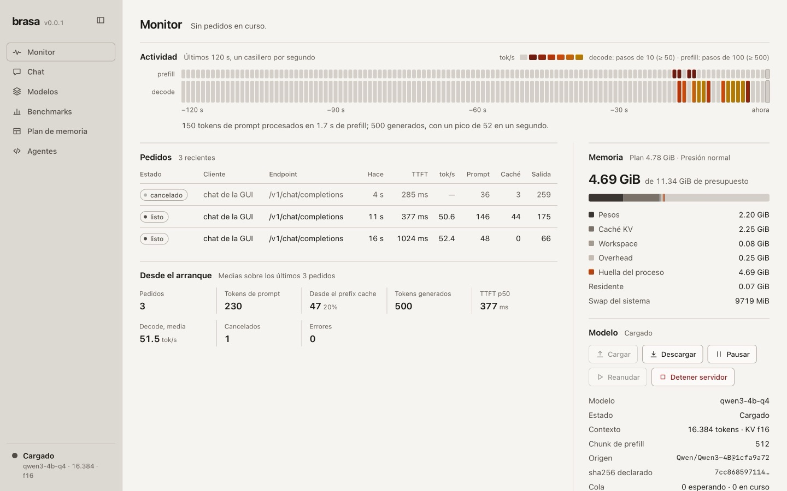

# Brasa

A local inference engine for Apple Silicon, written from scratch in Rust on Metal. You run it from
the terminal (`brasa`), it serves a local API compatible with OpenAI and Anthropic, and it ships an
embedded web GUI. It is built mainly to serve **agents with tools** (Claude Code, Codex, Cline,
OpenCode), not general chat.

- First model: **Qwen3-4B** (dense transformer, GQA, Apache-2.0), quantized to Q4 in groups of 32
  in the native `.brasa` format. The converted weights are on Hugging Face:
  [lautiss/brasa-v0.01-base](https://huggingface.co/lautiss/brasa-v0.01-base).
- No Python, and no Ollama, llama.cpp or MLX in the hot path.
- No outbound telemetry: the GUI loads nothing from the internet. The only network traffic is the
  model download you start.

The measured speed and memory figures, with chip, RAM, macOS and commits, are in
[docs/bench/baseline.md](docs/bench/baseline.md); this README only quotes them.

The project's working language is Spanish: the CLI, the GUI, the ADRs and the commit messages are
in Spanish.

## Requirements

- macOS on Apple Silicon (Metal). Target profiles: 16 GB and 8 GB of RAM.
- A Rust toolchain (`rustup`); `rust-toolchain.toml` pins the version.
- About 2.5 GB of disk for the default model.

## Install

From a checkout:

```bash
git clone https://github.com/lautaro005/brasa
cd brasa
./scripts/install.sh      # builds release and copies `brasa` to ~/.local/bin
brasa --version
```

`install.sh` does not install Rust. If `cargo` is missing it stops and points you to [rustup](https://rustup.rs). Set `BRASA_BIN_DIR` to copy the binary somewhere else.

From a package, without git. `scripts/package.sh` writes `dist/brasa-<date>-<commit>.tar.gz` and a `.sha256` next to it:

```bash
tar -xzf brasa-*.tar.gz && cd brasa-*/ && ./scripts/install.sh
```

In one line, once you have published the package at a URL (replace `<host>`; `BRASA_ARCHIVE_SHA256` is optional and is checked when set):

```bash
curl -fsSL https://<host>/install.sh | BRASA_ARCHIVE_URL=https://<host>/brasa.tar.gz BRASA_ARCHIVE_SHA256=<sha256> bash
```

Without `BRASA_ARCHIVE_URL`, the same command clones `https://github.com/Lautaro005/brasa.git` into `~/brasa`.

To use cargo directly: `cargo install --path crates/cli`.

## Getting started

1. Check the hardware and memory:

```bash
brasa doctor
```

2. Download the model. `brasa pull` fetches the already-converted weights from Hugging Face and
   checks every file's sha256 against the manifest embedded in the binary:

```bash
brasa pull qwen3-4b-q4
brasa models
```

   Models go to `~/Library/Application Support/brasa/models` unless you choose another folder
   (`models_dir` in `~/.config/brasa/config.toml`, `BRASA_MODELS`, or **Cambiar…** in the GUI's
   Models screen). `brasa config show` prints the folder in use and where it comes from.

3. Chat in the terminal:

```bash
brasa run qwen3-4b-q4
brasa run qwen3-4b-q4 --no-think -p "Hello"
```

4. Local server (OpenAI/Anthropic API and the GUI at `http://127.0.0.1:8080/ui`):

```bash
brasa serve qwen3-4b-q4 --ctx 16384
```

5. Connect an agent. `brasa connect` prints the configuration; `--apply` writes it (with a backup
   of anything it changes), and so does the **Conectar** button in the GUI:

```bash
brasa connect claude-code --apply
brasa connect codex --apply
```

Other commands:

```bash
brasa ps                            # status of a running server
brasa plan qwen3-4b-q4 --ctx 16384  # memory plan without loading the model
brasa benchmark --ctx 2048          # comparable benchmark report
brasa config show
brasa completions zsh
brasa storage                       # disk use: models, partial downloads, free space and reserve
brasa storage clean --apply         # delete stale partial downloads (without --apply: dry run)
brasa rm qwen3-4b-q4
```

## The GUI

`brasa serve` also serves a web GUI at `/ui`: a live monitor of requests and memory, a chat with
history, the models on disk and their download, benchmarks, the memory planner and agent
connection. Screenshots and the API it uses are in [docs/gui/](docs/gui/README.md).



## Guides (in Spanish)

- [Using it with agents](docs/guia/agentes.md): Claude Code, Codex, Cline and OpenCode.
- [Web GUI](docs/guia/gui.md).
- [Memory and KV cache](docs/guia/memoria-y-kv.md): profiles and `--kv`.
- [Troubleshooting](docs/guia/problemas.md).

## Layout

```text
crates/core        shared types
crates/metal       Metal device, buffers and pipelines
crates/kernels     .metal kernels and per-chip variants
crates/quant       weights format (.brasa), quantization and conversion
crates/tokenizer   BPE and chat template
crates/models      per-family adapters (qwen3) and forward pass
crates/memory      memory planner and per-profile budget
crates/tuner       hardware fingerprint and autotuning
crates/runtime     session: prefill, decode, sampling, prefix cache
crates/catalog     manifests, downloads and verification
crates/bench       benchmark harness and reports
crates/daemon      HTTP API, embedded GUI and status
crates/cli         the `brasa` binary
tools/             offline Python (references and utilities)
docs/adr/          architecture decision records
```

## Contributing and security

See [CONTRIBUTING.md](CONTRIBUTING.md) and [SECURITY.md](SECURITY.md).

## License

Apache-2.0 (see [LICENSE](LICENSE)). The Qwen3-4B weights are distributed under their own
license (Apache-2.0).
